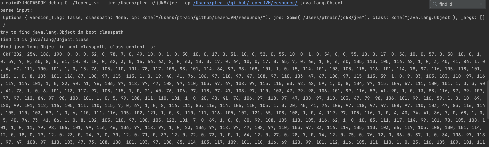
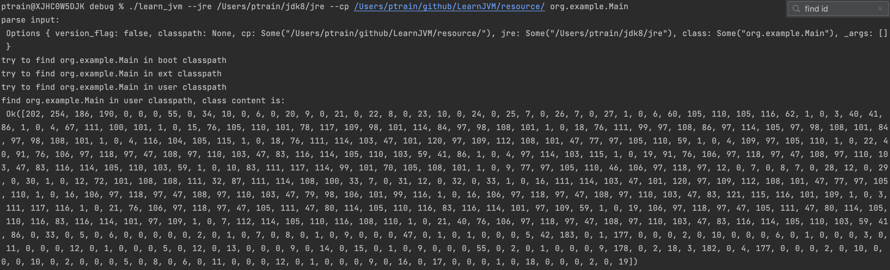

## ch02
久违的更新，基本实现了第二章查找类路径的功能(偷懒略有不同，主要就实现了 ZipEntry 和 DirEntry)

截图如下：

寻找 java.lang.Object

寻找 Demo 自定义 class

## 一些问题

### 不知道 Rust 如何用集合存储接口类型  
  目前使用 Box&lt;dyn Trait&gt; 来存储 
### Error 处理的感觉很别扭  
  由前面的经验封装了一下 Result，但是这次遇到了这样一个场景：  
  三个 classpath 下搜索一个 class 文件，要三个都找不到才会返回 error。但是单个 classpath 寻找 class 的过程中也会有各种 error 出现。单个 classpath 出现 not found 的时候，也不能直接返回 error，而是要等所有的都返回 not found 才行  
  目前，直接子方法也返回 Result，是不是返回 Option 就可以了？不太确定
