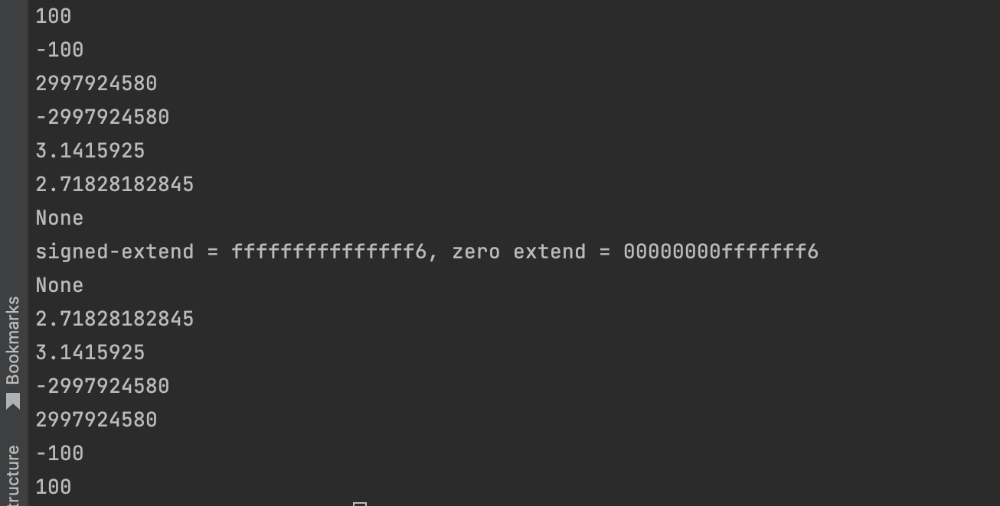

## ch04
实现了基础的局部变量表和操作数栈，完成了测试代码

## 问题

### slot 所有权问题
诸如 操作数栈 和 局部变量表，都由 slot 数组构成。

但是，似乎 rust 数组大小编译时就要明确告知，不能依靠一个变量来初始化数组大小长度

所以，最终用了 Vec

无论是 数组 还是 Vec，都有取值的时候，目前都是取的引用，不确定后面会不会有问题

其次就是，假如后面需要获取所有权，要么就得 copy，要么就得 remove，copy 也有对应问题，列在下面了

remove 的话，vec 长度就会变化，无法直接使用原本大小的 index 访问

### copy 问题

copy Box<T> 会触发 T 的拷贝，所以可能还要换成 Rc