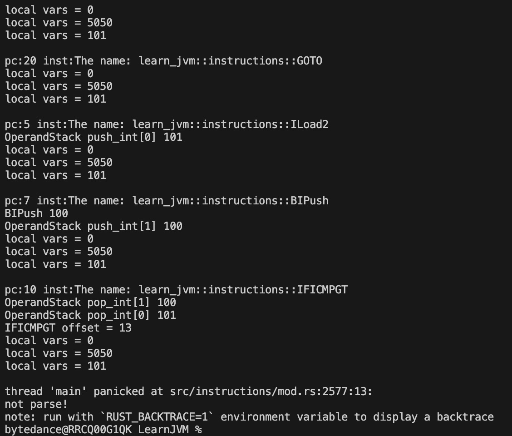

## ch05
实现了基础的指令解析和运行，完成了 for 循环 100 的简单测试

## 问题

对于 rust 理解的十分肤浅，以至于目前的代码完全不能看，just for compile success，许多地方所有权搞乱掉了，甚至 copy 了一份，许多地方留下了各种 TODO

因为目前只是测试基本类型加法，所以没什么问题

但是，考虑到以后如果有 object 的存在，heap 上的对象如何分配？rust 如何表示？

即使不考虑线程安全问题，使用 Rc 的话，那么 gc 就变为了引用计数(这倒也无所谓，以后可以再研究一些 gc 算法进行丰富)

同时，java runtime 各种对象的所有权究竟该属于谁？

thread 应该是持有 stack 和 frame，但是因为一开始没想好直接开写，导致现在有点乱，以至于不得不使用了 raw pointer

这也体现了另一个问题，想用 rust 写任何东西，都要先想好内存问题，不然写到一半会😭

总之，依然是 rust 的菜鸟中的菜鸟

打算后续实现了简单的类方法调用、支持 println 以后，整个项目重新用正确的方式重构一遍(目前，只是学习 rust 语法 和 jvm 原理)

